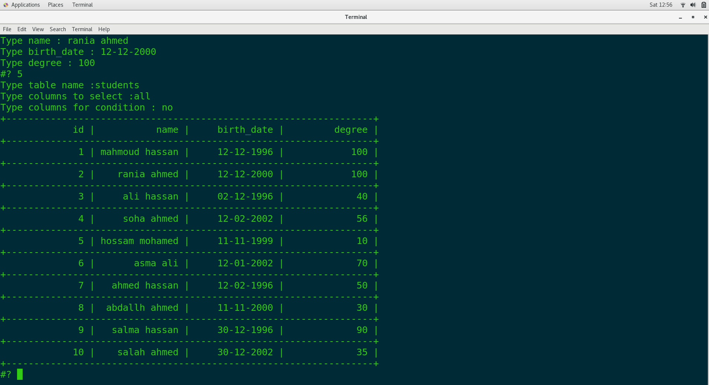
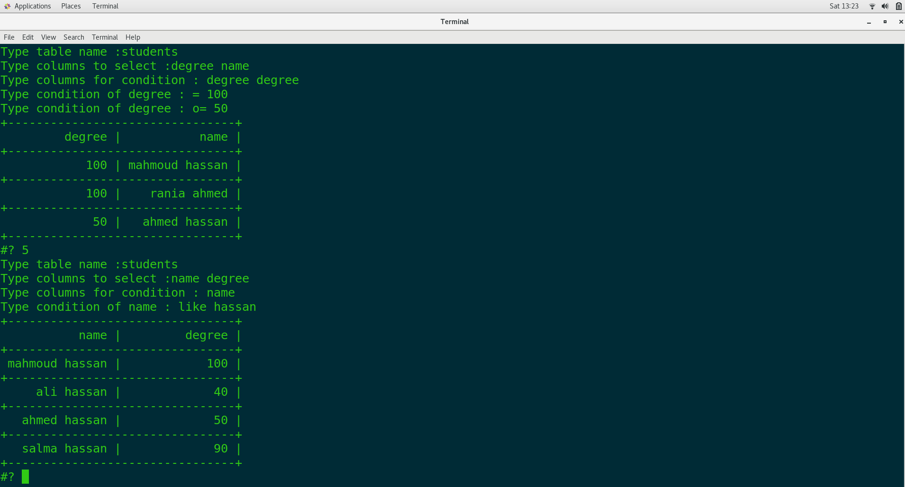

# Bash Scripting project(DBMS)

## create databases & list databases & connect to database
<ol>
  <li>create databases</li>
  <li>list databases</li>
  <li>drop database</li>
  <li> connect to database</li>
  <li>exit</li>
</ol>  

  

<h2> after connect to database</h2>
<ol>
  <li>create tables</li>
  <ul>
    <li>Custom data type</li>
    <li>customize primary key</li>
  </ul>
  <li>list tables</li>
  <li>delete table</li>
  <li>insert into table</li>
  <ul>
    <li>check datatype</li>
    <li>check primary ke</li>
  </ul>
  <li>select from table</li>
  <ul>
  <li>all columns</li>
  <li>condition with more columns</li>
  <li> = != like "< >" </li>
  <li>with  and | or  use a | o (o=|a=|olike|alik ....)</li>
  </ul>
  <li>delete from table</li>
    <ul>
  <li>all columns</li>
  <li>condition with more columns</li>
  <li> = != like > < </li>
  <li>with  and | or  use a | o (o=|a=|olike|alik ....)</li>
  </ul>
  <li>update columns table</li>
    <ul>
  <li>all columns</li>
  <li>condition with more columns</li>
  <li> = != like > < </li>
  <li>with  and | or  use a | o (o=|a=|olike|alik ....)</li>
  </ul>
</ol> 
<h2>create tables & list tables & insert tables</h2>

  

## create tables & list tables & insert tables

  

## select from tables with condition = != > < lik  a= is and field = , o> is or filed >

  
  
  
  
  
  
  

## delete from tables with condition = != > < lik  a= is and field = , o> is or filed >

  
  

## update from tables with condition = != > < lik  a= is and field = , o> is or filed >

  

<h2> developed by :</h2>
<ul>
  <li>mahmoud hassan</li>
<li>rania ahmed</li>
</ul>
