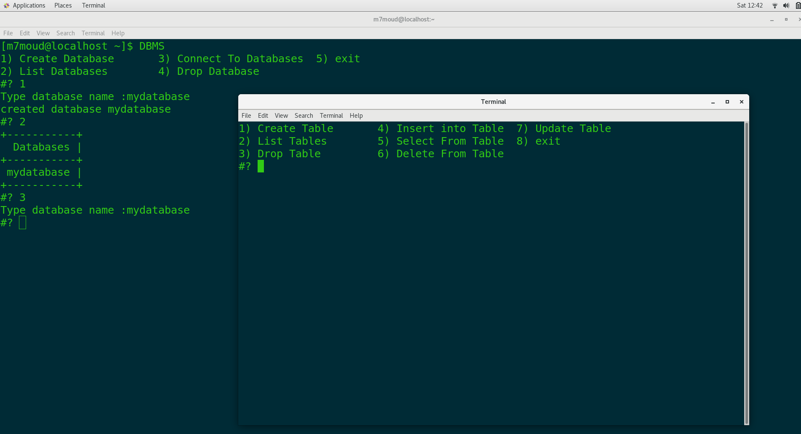
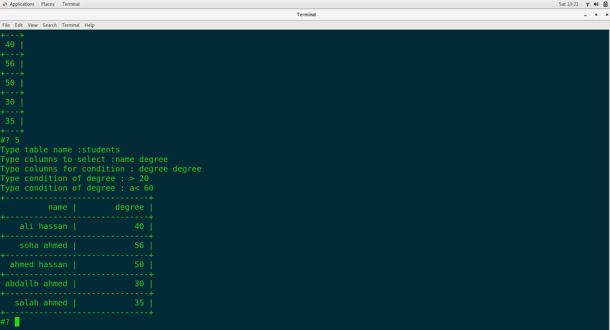
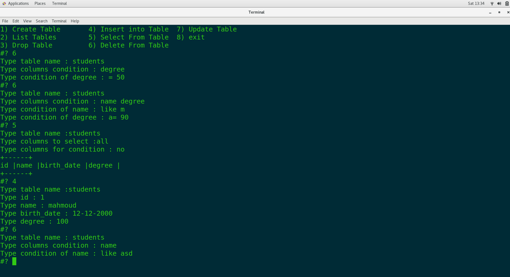

# create databases & list databases & connect to database

  

# create tables & list tables & insert tables

  

# create tables & list tables & insert tables

  

#select from tables with condition = != > < lik  a= is and field = , o> is or filed >

  
  
  
  
  
  
  

#delete from tables with condition = != > < lik  a= is and field = , o> is or filed >

  
  

#update from tables with condition = != > < lik  a= is and field = , o> is or filed >

  

